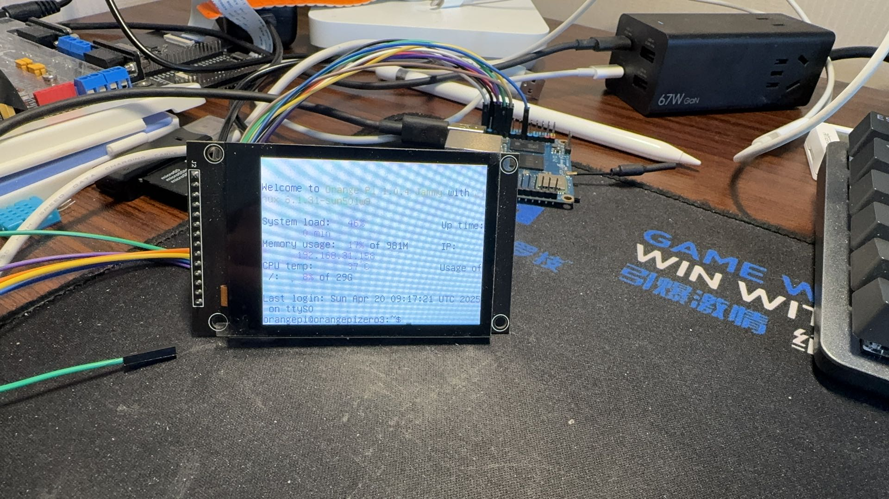

# 📚 项目文档总览

欢迎来到本项目的文档目录。本项目基于 Orange Pi Zero3，构建了一个包含温湿度采集、触摸屏、图形界面、Web 显示和数据存储的嵌入式系统。

---

## 📁 文档结构

| 文件名              | 说明 |
|---------------------|------|
| `build_guide.md`    | 编译内核、设备树和驱动模块的完整流程说明 |
| `template.md`       | 编写驱动模块 README.md 的模板，可复制使用 |
| `todo.md`           | 当前项目的开发计划与待办事项清单 |
| `qt_notes.md`       | Qt UI 开发相关笔记|
| `web_notes.md`      | Web 服务与远程数据交互相关文档 |
| `hardware_notes.md` | 外设连接方式、GPIO 引脚图、接线图等说明 |

---

## 🏁 开发者快速上手

1. 阅读 [build_guide.md](./build_guide.md) 完成编译环境配置；
2. 根据 `todo.md` 查看当前开发任务；
3. 若需添加新驱动模块，请参考 [template.md](./template.md)；
4. UI 开发请查看 Qt 相关笔记；
5. Web 服务部署与数据展示请查看 Web 开发笔记。

---

## 🧱 目录结构

项目结构如下：

```
orangepi_netemper_project/
├── drivers/
├── qt_ui/
├── web/
├── docs/           # ← 文档目录
│   ├── README.md   # ← 当前文档
│   ├── build_guide.md
│   ├── todo.md
│   └── ...
├── scripts/
└── ...
```
## 效果图
在ili9341上显示 命令行，还有偏色。



## 📎 相关资料：

### DataSheet:
[DHT11 Datasheet (PDF)](../docs/datasheets/dht11_datasheet.pdf)
[ILI9341 Datasheet (PDF)](../docs/datasheets/ILI9341_Datasheet.pdf)
[DHT11 Datasheet (PDF)](../docs/datasheets/FT6336G-DataSheet.pdf)

来源：立创商城搜索，淘宝商家给予。
---

## 🧩 贡献建议

欢迎你不断更新 `docs/` 目录来记录你的开发笔记和思路，这将极大提升项目维护性与可复用性 💡


    